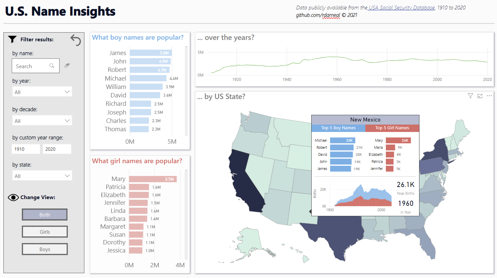
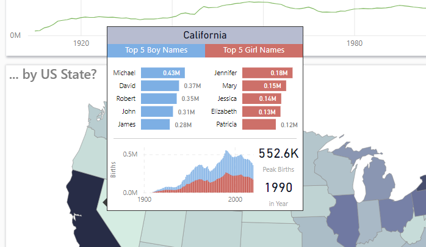
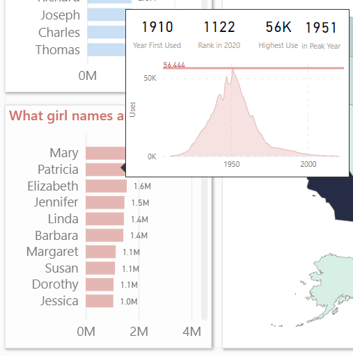

<br />
<div align="center">

<h3 align="center">PowerBI US Name Dashboard</h3>

  <p align="center">
    A small powerBI dashboard built using the US Social Security names dataset
  </p>
</div>


<!-- TABLE OF CONTENTS -->
<details>
  <summary>Table of Contents</summary>
  <ol>
    <li>
      <a href="#about-the-project">About The Project</a>
    </li>
    <li>
      <a href="#getting-started">Getting Started</a>
    </li>
    <li><a href="#usage">Usage</a></li>
  </ol>
</details>


<!-- ABOUT THE PROJECT -->
## About The Project



A minimal PowerBI dashboard demo utilizing tooltips, built on the US names database dataset. Includes filter and sorting for identifying various name related statistics.

<p align="right">(<a href="#readme-top">back to top</a>)</p>


<!-- GETTING STARTED -->
## Getting Started

To get a local copy up and running follow these simple example steps.

1. Download PowerBI Desktop from the Windows Store or source.
2. Clone this repository
   ```sh
   git clone https://github.com/rdarneal/powerbi_us_name_report.git
   ```
3. Open the babynames.pbix file in PowerBI

<p align="right">(<a href="#readme-top">back to top</a>)</p>


<!-- USAGE EXAMPLES -->
## Usage

You can use this dashboard to identify name trends by each US state, or by boy/girl names. There are tooltips on the horizontal stacked bar charts and the map visual that allow you to get further insight into name statistics.

Hover over states to see name statistics


Hover over bar charts to see additional name trend statistics



<p align="right">(<a href="#readme-top">back to top</a>)</p>
